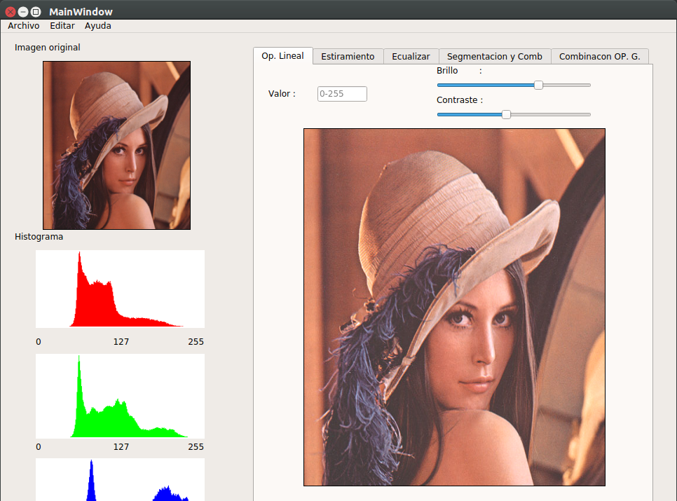

# T.-Grafica
Leer archivo bmp

# Operaciones elementales:
## suma
## resta
## multipli o div

# Transformacion del histograma
## Estiramiento
## Ecualizacion
## Segmentacion de objetos

# Combinacion de imagenes
## Sumar
## 	Restar
## 	Producto
## 	Division
## 	Mezcla de imagenes
