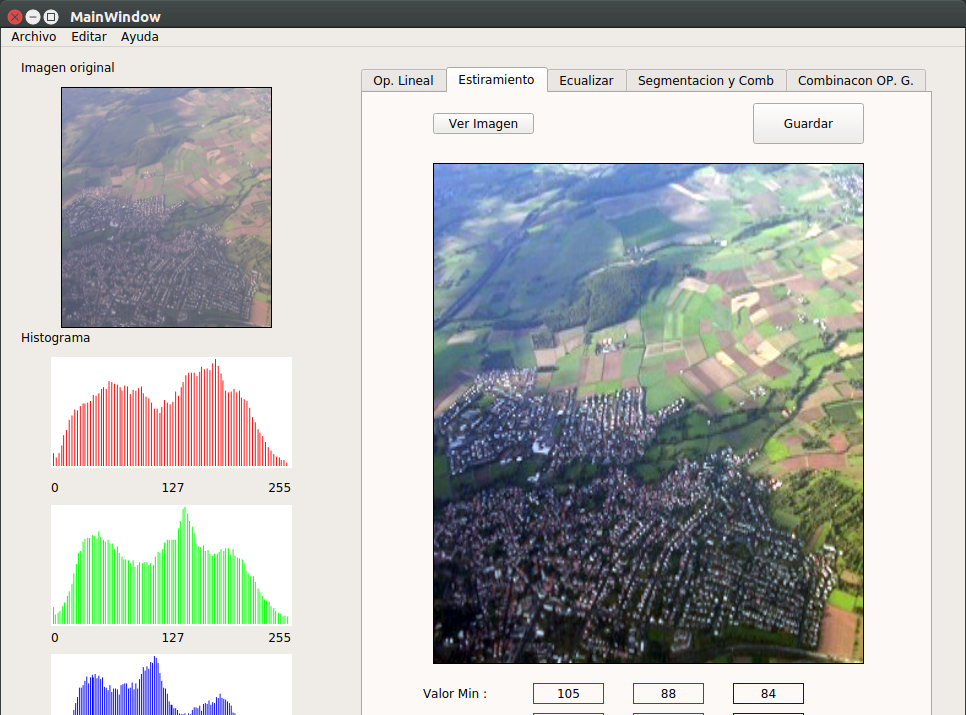
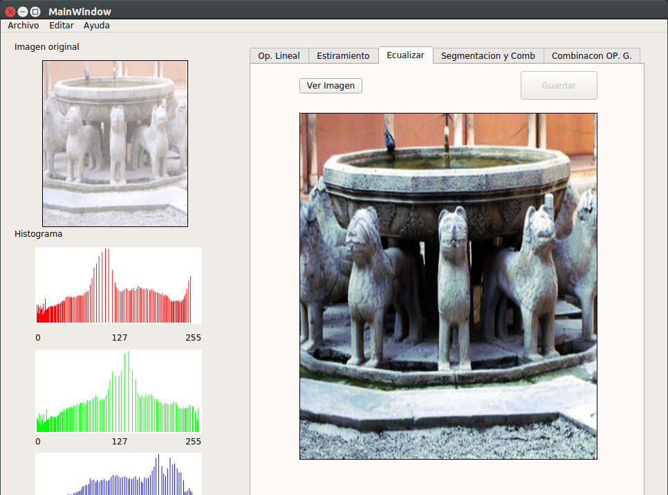
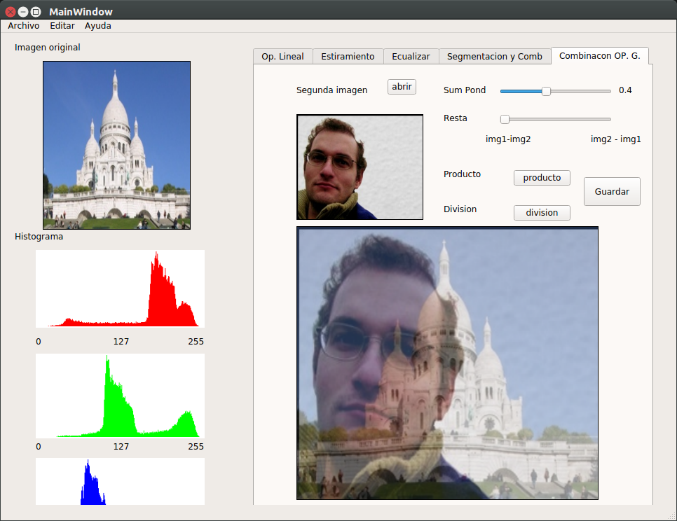
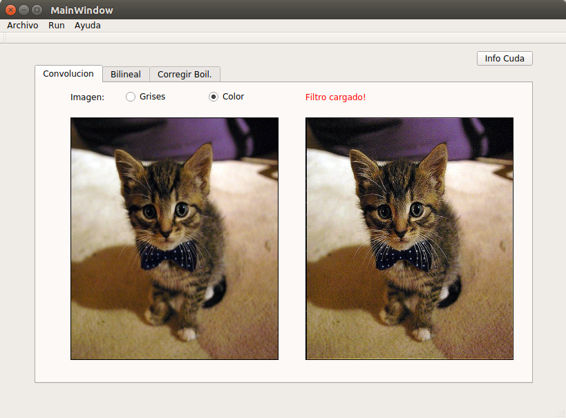
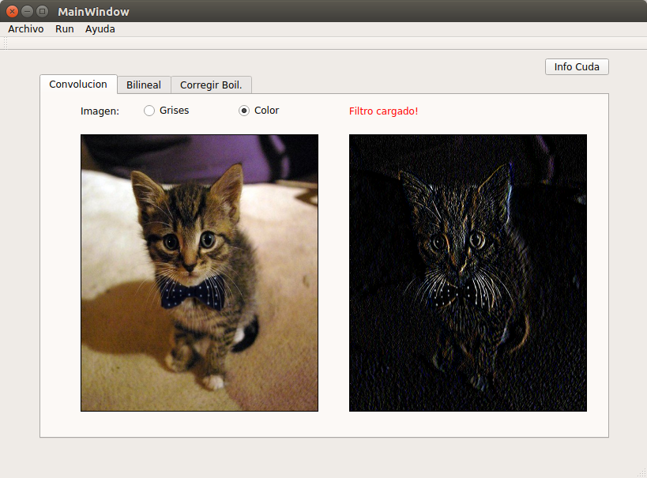
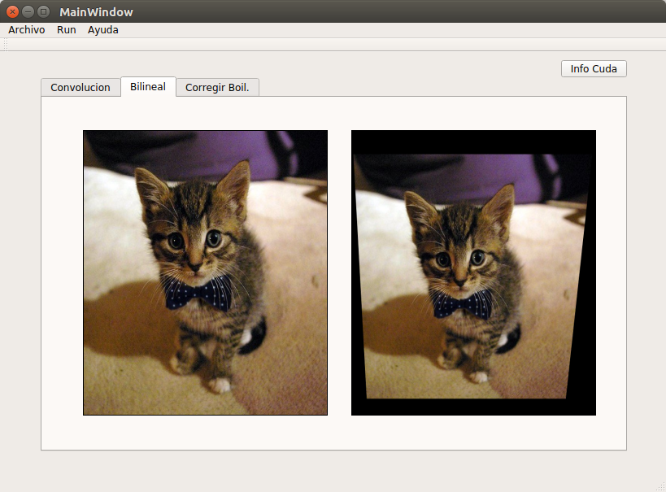

# T. Grafica
- **Leer archivo .bmp**
- Proyecto **untitled** contiene las op. elementales, trasnformacion del histograma , combinacion de imagenes
- Proyecto **cuda_test** contiene filtros y transformaciones, trasnformacion geometrica con cuatro puntos iniciales.

# Operaciones elementales:
## suma: 
    brillo
## resta: 
    brillo
## multiplicacion , division: 
    contraste
### Screnshoot operaciones elementales:

# Transformacion del histograma
## Estiramiento: 

## Ecualizacion

## Segmentacion de objetos

# Combinacion de imagenes
    Sumar
    Restar
    Producto
    Division
    Mezcla de imagenes
### 

# Filtros y transformaciones:
	Convolucion: (en GPU) Ej:1

    Convolucion: (en GPU) Ej:2

# Transformaciones geométricas:
## Escoger una imagen, escoger cuatro puntos -> distorsiona

